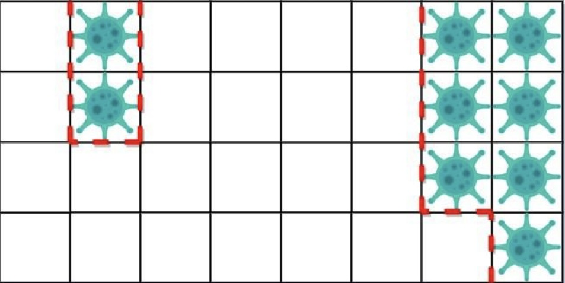

# Quacktine

This is the first challenge of the acent cs50 tournament project, which is an n\*m table, where n is the number of rows and m is the number of columns, which should only contain 1 and 0.
1's are viruses in this project and 0's mean they were not infected.

# **about program**

<font size="5">_Function: main()_</font>\
The main() function serves as the entry point of the program. It is responsible for executing the main logic of the code.\
The main() function performs the following steps:

1. It attempts to read two space-separated integers row and column from the user's input, representing the dimensions of the table.

- If the input cannot be successfully split into two integers or an error occurs during conversion, the program will quit.

2. An empty list called table is created to store the table data.

3. The function enters a loop that runs row times. In each iteration, it attempts to read a line of input and convert it into a list of integers representing a row of the table.

- If the number of elements in the row does not match the expected column size, the program will quit.
- If an error occurs during input reading or conversion, the program will quit.

4. After successfully populating the table list, the function calls the count_walls() function, passing the table as an argument, and prints the result.

# **What does this program do?**

The provided code is a Python program that counts the number of walls in a given table. The table is represented as a two-dimensional list, where each element is either 0 or 1. The program takes input from the user to create the table and then calculates the number of walls based on certain conditions.

<font size="5">_Function: count_walls(table)_</font>\
The count_walls() function takes a table as input and returns the count of walls present in the table.\
The count_walls() function performs the following steps:

1. It determines the dimensions of the table by obtaining the length of the table list (m) and the length of the first row in the table (n).
2. It initializes a variable walls to keep track of the number of walls and sets it to 0.
3. The function then iterates through each cell of the table using nested loops (i for rows and j for columns).
4. For each cell, the function checks the neighboring cells (top, bottom, left, and right) to determine whether the current cell should be spanned or not. Considers table boundaries to handle edge cases properly.
   For example, if it is the first row, there is no element above it to check, so up = table [i][j]
   If it is the last row, there is no element below it to check, so down = table [i][j]
   For each row, the first and last columns are also the same, and there are no elements on the left or right
5. If the current cell is a wall (table[i][j] == 1), i.e. none of the adjacent cells is a wall (top, bottom, left, or right is 0), the number of walls is incremented accordingly.
6. After examining all cells, the function returns the total count of walls.

# **Example**

Let's consider the following example:\
<font size="3">_input:_</font>

```json
3 3
1 1 1
1 0 1
1 1 1
```

In this example, the input represents a 3x3 table with the following elements:

```json
1 1 1
1 0 1
1 1 1
```


<font size="3">_output:_</font>

```json
4
```

another example\
<font size="3">_input:_</font>

```json
4 8
0 1 0 0 0 0 1 1
0 1 0 0 0 0 1 1
0 0 0 0 0 0 1 1
0 0 0 0 0 0 0 1
```

In this example, the input represents a 4x8 table with the following elements:

```json
0 1 0 0 0 0 1 1
0 1 0 0 0 0 1 1
0 0 0 0 0 0 1 1
0 0 0 0 0 0 0 1
```



<font size="3">_output:_</font>

```json
10
```

# Usage

To use this script, follow the steps below:

1. Clone the repository to your local machine or download the quacktine.py file directly.

2. Make sure you have Python 3.x installed on your machine.

3. Open a terminal or command prompt and navigate to the directory where the quacktine.py file is located.

4. Run the script by executing the following command:
   ```
   python quacktine.py
   ```
5. Enter the input as per the instructions provided by the script.

- First, enter the dimensions of the table (number of rows and columns) separated by a space.
- Next, enter the elements of the table row by row, with each element separated by a space.

6. The script will output the total number of walls present in the table.

_input_:

```json
3 4
0 1 1 0
1 0 0 1
1 1 0 1
```

The program will output the number of walls in the table.\
_output:_

```json
8
```

You can run the program multiple times with different table configurations.

# Installation

Follow the instructions below to install the necessary dependencies and run the program:\
<font size="3"> **local system**</font>

1. Install Python (if not already installed) from the official [Python website](https://www.python.org/).\

2. Clone or download the source code from the GitHub repository: [https://github.com/me50/Aida-adzd](https://github.com/me50/Aida-adzd).\
   $ git clone https://github.com/your-username/Aida-adzd.git(اینجا کسشر است زیرا فایل آپلود نشده هنوز)

3. Navigate to the project directory.\
   `$ cd /path/to/Aida-adzd `

4. (Optional) Create and activate a virtual environment to isolate the project dependencies.\
   `$ python -m venv venv`\
   `$ source venv/bin/activate`

5. Install the required dependencies using pip.\
   `$ pip install -r requirements.txt`

6. Run the program.\
   `$ python quacktine.py`

7. Follow the usage instructions mentioned above to input table dimensions and values.

<font size="3"> **online codespace**</font>\
bizzz
